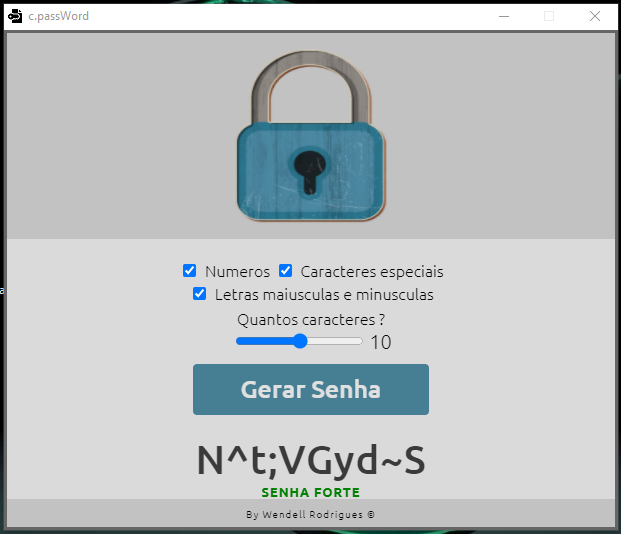

# Projeto c.passWord  🔐

#### Tecnologias utilizadas 💻

	* HTML
	* CSS
	* JavaScript
	* Electron

## Descrição do projeto 📑

​	Projeto simples que simula um gerador de Senhas, classificando-as em três níveis : FRACA, MÉDIA E FORTE.

Ele permite escolher quantos e quais caracteres você deseja que sua senha possua, você pode escolher entre fazer uma senha somente com números, ou letras, ou caracteres especiais.

 Você também pode escolher quantos caracteres deseja que sua senha possua, ao escolher todas as informações necessárias para gerar a sua senha, você deverá clicar em "Gerar Senha" , e sua senha será gerada instantaneamente.

### Conceitos Aplicados 📚

	- [x] HTML Dinâmico
	- [x] Manipulação do DOM
	- [x] Funções
	- [x] Operadores ternários

	- [x] Capitação de eventos do mouse
	- [x] Condicionais
	- [x] Loops

---

 <small>Me chame no meu  [Linkedin](https://www.linkedin.com/in/wendell-rodrigues-30011997/) Vamos conversar!  👋🏻</small>

<small>Desenvolvido com ❤️ por Wendell Rodrigues</small>

